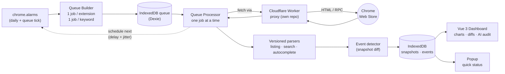

<div align="center">


# CWS Tracker

**App Store Optimization (ASO) & competitive intelligence for the Chrome Web Store — as a Chrome extension.**

Track keyword rankings, watch every competitor's listing for changes, score your own
listing quality, and ask an LLM *"why is this competitor ranking above me?"* — all
running locally in your browser, with your data never leaving the machine.

[](https://developer.chrome.com/docs/extensions/mv3/intro/)
[](https://vuejs.org/)
[](https://www.typescriptlang.org/)
[](https://vitejs.dev/)
[](#testing)
[](./LICENSE)
[](./CHANGELOG.md)

</div>

---

## Table of contents

- [What it does](#what-it-does)
- [How it works](#how-it-works)
- [Feature tour](#feature-tour)
  - [Competitor intelligence](#-competitor-intelligence)
  - [Keyword & ranking analytics](#-keyword--ranking-analytics)
  - [Autocomplete / search-suggestion tracking](#-autocomplete--search-suggestion-tracking)
  - [Listing quality & optimization](#-listing-quality--optimization)
  - [AI-powered keyword audit](#-ai-powered-keyword-audit)
  - [Change detection & event timeline](#-change-detection--event-timeline)
  - [Your data stays yours](#-your-data-stays-yours)
- [Architecture](#architecture)
- [Tech stack](#tech-stack)
- [Getting started](#getting-started)
- [Project structure](#project-structure)
- [Testing](#testing)
- [License](#license)
- [Contributing](#contributing)

---

## What it does

CWS Tracker turns the public Chrome Web Store into a queryable, historical dataset for
**your extensions and your competitors'**. It runs entirely as an MV3 extension: a
background service worker scrapes the store on a schedule through a thin proxy, parses
the responses with versioned parsers, and stores every snapshot in IndexedDB. A Vue 3
dashboard then renders the history as charts, diffs, comparison tables, and AI audits.

| You want to… | CWS Tracker gives you… |
| --- | --- |
| **Know where you rank** for every target keyword, every day | Daily keyword-position tracking with inverted-axis rank charts, heatmaps, and per-keyword history |
| **Catch a competitor's every move** | Field-level change detection (title, description, version, permissions, screenshots, translations, badges, size) with a chronological event timeline |
| **See *what* changed, not just *that* it changed** | Word-level text diffs and permission diffs with install-warning context |
| **Benchmark your listing** against rivals | A composite 0–100 quality score with per-component breakdown and prioritized fix recommendations |
| **Understand *why* you're losing** a keyword | An LLM-powered audit that compares both listings and explains the gap |
| **Find keywords you're missing** | Gap analysis, keyword-difficulty estimation, density matrices, and autocomplete-suggestion mining |
| **Own your data** | Everything lives in your browser's IndexedDB; full JSON import/export; no accounts, no servers |

---

## How it works

Every scan is a sequence of **single** CWS requests issued from a persistent IndexedDB
queue — never in parallel, always with randomized jitter — so the workload looks like a
human, survives service-worker death, and resumes exactly where it stopped.



**The scan loop, step by step:**

1. A `dailyScan` **alarm** fires (or you hit *Refresh*). The **queue builder** creates
   one `listing_scan` job per unique extension (deduplicated across projects), one
   `keyword_scan` per keyword, and one `autocomplete_scan` per keyword.
2. Jobs are persisted to an IndexedDB **queue** with priority ordering (your listing →
   competitor listings → keyword scans → autocomplete).
3. The **queue processor** dequeues exactly one job, fetches the page through the
   **proxy** (required — the store blocks direct extension-origin requests via CORS),
   and parses it with a **versioned parser**.
4. The **event detector** diffs the new snapshot against the previous one and writes
   change events. Snapshots and events land in IndexedDB.
5. The processor schedules the next queue tick with a base delay **plus jitter**, then
   the loop repeats. One keyword search returns positions for *all* tracked extensions
   at once, so a scan is `1 request per keyword`, not per keyword-per-extension.

> **Resilience by design.** The queue lives in IndexedDB, not memory. On service-worker
> startup any `running` jobs are reset to `pending`, so a scan interrupted by SW
> termination simply continues. The next alarm is always scheduled *after* a job
> completes, never before.

---

## Feature tour

### 🔎 Competitor intelligence

Add any competitor by Chrome Web Store URL or raw 32-char ID and CWS Tracker starts
building a daily history of their listing.

- **Per-competitor overview page** — a dedicated dashboard scoped to one competitor:
  listing details, users/reviews trend, keyword rank history, autocomplete history,
  position tables, and that competitor's recent events.
- **Side-by-side listing comparison** — pick 2–4 extensions and compare titles, short
  and full descriptions, permissions, ratings, reviews, users, screenshot/translation
  counts, and a keyword-density matrix — with your tracked keywords highlighted in-line.
- **Permission risk scoring** — a 0–100 risk score per extension from weighted Chrome
  permissions, surfaced as color-coded bars so you can see who is over-asking.
- **Extensions overview table** — every tracked extension's metrics over time, with a
  **Daily/Weekly step toggle** and day-over-day / week-over-week deltas.

### 📈 Keyword & ranking analytics

- **Daily keyword-position tracking** for every tracked extension across all target
  keywords — one search request captures positions for everyone you track.
- **Rank charts** with an inverted Y-axis (position #1 at the top), multi-extension
  series, smooth curves, and **event annotations** drawn as color-coded vertical lines
  at the dates listings changed.
- **Rank heatmap** and **keyword scatter plot** for spotting patterns across many
  keyword/extension pairs at a glance.
- **Unstable-rank detection** — CWS search results are genuinely noisy (an extension can
  oscillate between #10, #20, and out-of-top-30 within minutes), so a single dropped
  scan is flagged as a debounced amber **"Unstable"** with a one-click **Re-scan**, and
  only escalates to a real **"Out"** after a second consecutive confirming miss.
- **Keyword analysis** — a frequency matrix (how often each keyword appears in each
  rival's title/short/full text), **gap analysis** (keywords competitors use that you
  don't), and **difficulty estimation** (0–100, derived from the rating, user count, and
  quality of the top-ranking extensions).

### 💡 Autocomplete / search-suggestion tracking

The store's search box is its own ranking surface. CWS Tracker tracks the
`QcU9bc` autocomplete RPC to answer *"does the store recommend my extension as you
type?"*

- **Autocomplete position history** — chart and table of where your extension appears in
  the suggestion dropdown over the last 7/14/30 days, with color-coded positions and
  deltas.
- **Keyword discovery** — text suggestions surfaced by the store become candidate
  keywords you may not be tracking yet.
- **Coverage chart** — how much of the suggestion surface you (and rivals) occupy.

### 🏆 Listing quality & optimization

A composite **0–100 quality score** computed from nine weighted components, each with an
actionable recommendation when it scores below par:

| Component | Weight | What it rewards |
| --- | :---: | --- |
| Title optimization | 15% | Length in the 20–60 char sweet spot, no stuffing |
| Full description | 15% | 150–1000 words + real structure (paragraphs, bullets) |
| Visual assets | 15% | 3–5 screenshots + promo video |
| Ratings & reviews | 15% | Star quality + review volume |
| Short description | 10% | Use of the 132-char limit |
| Translations | 10% | Locale count + major-market coverage |
| Update freshness | 10% | Recently updated beats abandoned |
| Permissions | 5% | Lower permission risk = higher quality |
| Developer profile | 5% | Verified publisher |

Plus **Flesch reading-ease** readability scoring and per-keyword **density matrices** so
you can tune copy, not guess at it.

### 🤖 AI-powered keyword audit

For any keyword where a competitor outranks you, click **"Why higher?"** to run a
keyword audit through your own OpenAI key:

- Feeds **both** listings, current positions, metrics, quality scores, and permission
  risk into a structured prompt.
- Returns a relevance analysis, a metric-by-metric comparison, and **prioritized
  (high/medium/low) recommendations**.
- **Cost shown before you run it**, results **cached per day** so re-opens are free, and
  prompt variants (default / chain-of-thought / rubric-scored) are switchable in
  Settings.

> The OpenAI host permission is **optional** and only requested at runtime when you enter
> a key. No key, no network calls to OpenAI — every other feature works without it.

### 🛎️ Change detection & event timeline

Every scan diffs the new snapshot against the last and records typed events you can
filter and color-code on a chronological timeline — and annotate directly onto rank
charts:

`title_change` · `description_change` · `version_change` · `permission_change` ·
`rating_milestone` · `user_milestone` · `translation_change` · `screenshot_change` ·
`badge_change` · `rank_change` · `size_change`

Expand any text or permission event to see a **word-level diff** (additions in green,
removals struck through in red) or a **permission diff** with the matching Chrome install
warnings — so a "permissions changed" event tells you *exactly* what new access a rival
just requested.

### 🔒 Your data stays yours

- **Local-first.** Every snapshot, event, and setting lives in your browser
  (`IndexedDB` + `chrome.storage.local`). No account, no backend, no telemetry.
- **Full JSON import/export** of all projects, extensions, keywords, snapshots, events,
  and settings — atomic, transactional, round-trip-safe.
- **Bring-your-own-proxy.** The scanning proxy is a free, one-click-deployable Cloudflare
  Worker in its own repo ([`shapito27/cws-tracker-proxy`](https://github.com/shapito27/cws-tracker-proxy))
  that you host. API keys are redacted from all scan logs.

---

## Architecture

Three **isolated contexts** that never import across their boundaries, plus a shared
core:

```
┌────────────────────────┐   chrome.runtime   ┌────────────────────────┐
│  Service Worker        │  ◄──────────────►  │  Dashboard (Vue 3)     │
│  src/background/        │     messages       │  src/dashboard/        │
│  • scrape + queue       │                    │  • charts / diffs       │
│  • chrome.alarms        │                    │  • AI audit             │
│  • versioned parsers    │                    │  • reads IndexedDB      │
│  NO DOM / NO Vue        │                    │                        │
└───────────┬────────────┘                    └───────────┬────────────┘
            │                                              │
            │            ┌────────────────────┐            │
            └──────────► │  Shared             │ ◄──────────┘
                         │  src/shared/        │
                         │  • Dexie DB wrapper │
                         │  • types · utils    │
                         │  (pure / IndexedDB) │
                         └────────────────────┘
                                    ▲
                         ┌──────────┴─────────┐
                         │  Popup (Vue 3)      │  quick status view
                         │  src/popup/         │
                         └────────────────────┘
```

- **Service Worker** (`src/background/`) — all CWS fetching, the IndexedDB-backed queue,
  `chrome.alarms` scheduling, and versioned parsers. No DOM, no Vue, no `window`. All
  `chrome.*` listeners are registered synchronously at the top level so MV3 can wake the
  worker into them.
- **Dashboard** (`src/dashboard/`) — the Vue 3 SPA (hash routing for `chrome-extension://`
  URLs). Reads IndexedDB through Dexie and receives push updates from the SW via
  `chrome.runtime.onMessage`. State is plain Vue composables — **no Pinia**.
- **Popup** (`src/popup/`) — a lightweight status view sharing the composable pattern.
- **Shared** (`src/shared/`) — types, the `CWSDatabase` Dexie wrapper (the *only* path to
  IndexedDB), and pure utilities. No browser-specific APIs beyond IndexedDB.

**Parsers are versioned and fixture-tested.** Each implements a `ListingParser`,
`SearchParser`, or `AutocompleteParser` interface; a `ParserFactory` selects the version
from settings. When the store changes its markup, a *new* version is added rather than
mutating the old one, and parsers are tested against saved CWS HTML fixtures — never
mocked internally, never hitting the live network in tests.

---

## Tech stack

| Layer | Choice |
| --- | --- |
| **Framework** | Vue 3 (Composition API, `<script setup>`) + TypeScript (strict, ES2022) |
| **Bundler** | Vite 5 + `@crxjs/vite-plugin` (MV3 HMR) |
| **Styling** | Tailwind CSS v4 (`@tailwindcss/vite` plugin) |
| **Charts** | ApexCharts via `vue3-apexcharts` (split into its own chunk) |
| **Database** | Dexie.js v4 over IndexedDB (schema v4) |
| **Settings** | `chrome.storage.local` |
| **AI** | OpenAI API (user-provided key, optional runtime permission) |
| **Proxy** | Cloudflare Worker ([separate repo](https://github.com/shapito27/cws-tracker-proxy)) |
| **State** | Vue composables (`ref`/`reactive`/`computed`) — no Pinia |
| **Routing** | Vue Router with `createWebHashHistory` |
| **Testing** | Vitest + `fake-indexeddb` + jsdom + `@vue/test-utils` |

---

## Getting started

```bash
npm install
npm run dev          # Vite dev server with CRXJS HMR
npm run build:only   # Production build to dist/
npm test             # Run the full Vitest suite
npm run typecheck    # Type-check with vue-tsc (also checks .vue files)
```

**Load the unpacked extension:**

```bash
npm run build:only
```

→ open `chrome://extensions` → enable **Developer mode** → **Load unpacked** → select the
`dist/` folder.

**Configure scanning (required).** Because the Chrome Web Store blocks direct
extension-origin requests, you must point CWS Tracker at a proxy before it can scan. Open
**Settings → Proxy** and either:

- click **Deploy to Cloudflare** to spin up your own free proxy from
  [`shapito27/cws-tracker-proxy`](https://github.com/shapito27/cws-tracker-proxy) in one
  click, then paste the URL (and optional API key) and hit **Test Connection**; or
- point it at an existing CWS Tracker proxy you already host.

To use the AI audit, also add your OpenAI key under **Settings → API Keys** (this is the
only feature that needs it).

---

## Project structure

```
src/
  background/    # Service worker: scraping, queue, alarms, versioned parsers (no DOM/Vue)
  dashboard/     # Full-page Vue app: pages, composables (state), charts, diffs, AI audit
  popup/         # Lightweight Vue status view
  shared/        # Types, Dexie DB wrapper, pure utils — the only cross-context code
tests/
  unit/          # Mirrors src/ structure
  integration/   # End-to-end scan-cycle tests
  fixtures/      # Saved CWS HTML/RPC responses (parser tests run against these)
  mocks/         # Chrome API mock (storage, alarms, runtime, action, tabs, permissions)
```

See [`CLAUDE.md`](./CLAUDE.md) for the full architecture rules, conventions, and command
reference.

---

## Testing

**1,249 tests across 48 files**, run with Vitest against `fake-indexeddb` and jsdom — no
real Chrome Web Store network calls, ever. Parser tests run against saved HTML/RPC
fixtures, and an integration suite exercises the complete scan cycle, including
service-worker restart mid-scan, fetch retries with exponential backoff, 404 handling,
cross-project deduplication, and data-retention pruning.

```bash
npm test               # all tests
npm run test:watch     # watch mode
npm run test:coverage  # coverage report
```

---

## License

**Source-available, not open source.** CWS Tracker is licensed under the
[PolyForm Noncommercial License 1.0.0](./LICENSE).

- ✅ **Free** for any noncommercial purpose — personal projects, study, research,
  evaluation, and use by nonprofit / educational / government organizations.
- ❌ **Commercial use requires a paid license.** Using CWS Tracker in or for a business,
  or to generate revenue, is not covered by the free license.
- 🚫 You may **not** sell, host, or redistribute it as a commercial product or service.

The source is public so you can read it, audit it, self-host it, and contribute fixes —
but it does **not** grant the freedoms of an OSI-approved open source license.

**Commercial licensing.** Want to use CWS Tracker commercially? A separate commercial
license is available — contact **benmakartni@gmail.com**.

## Contributing

Contributions are welcome under the Developer Certificate of Origin (DCO). See
[CONTRIBUTING.md](./CONTRIBUTING.md) for how to sign off your commits, and
[`CLAUDE.md`](./CLAUDE.md) for architecture and conventions to follow.
